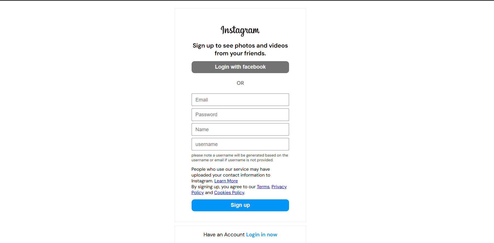
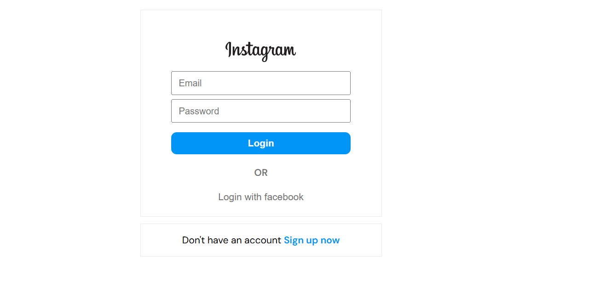
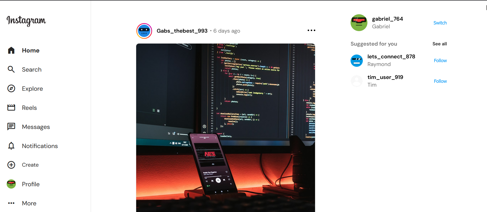
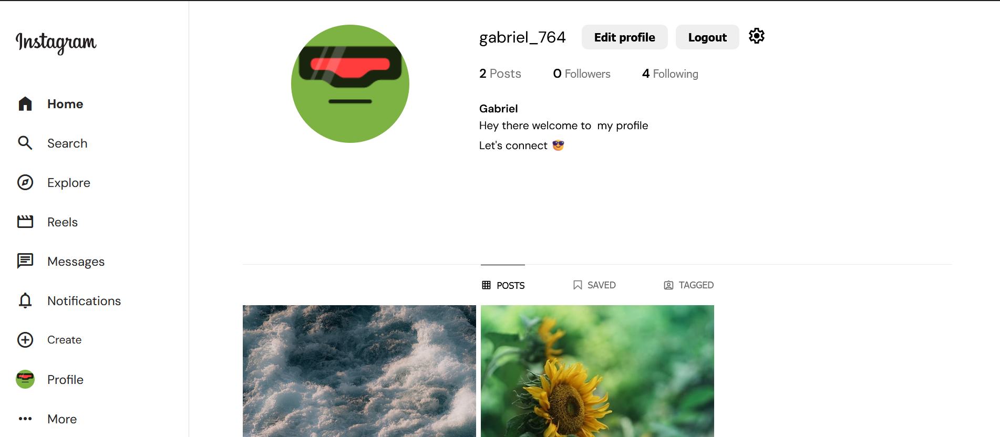
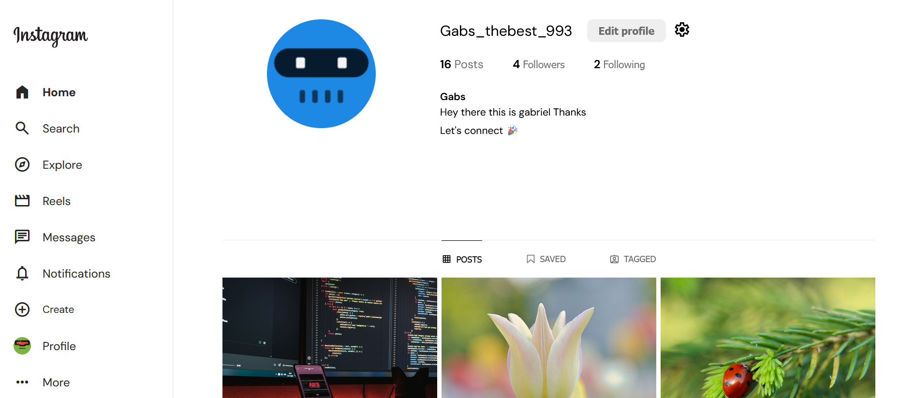

# Instagram Profile Clone 🚀

This project is a **Vanilla JavaScript** and **Vite-powered** Instagram-like profile page, featuring **Firebase Authentication**, **Firebase Realtime Database**, **image storage**, and **dynamic post creation**.

## 🌟 Features

✅ **User Authentication** – Sign up & login using Firebase  
✅ **Image Storage** – Upload and display posts using Firebase Storage  
✅ **Realtime Posts** – Posts are stored dynamically in Firebase Realtime Database  
✅ **User Data Storage** – Each user's information is securely stored in Firebase Realtime Database  
✅ **Following System** – Users can follow profiles  
✅ **Responsive Grid Layout** – Displays posts in an Instagram-style format

### 🔧 Upcoming Features

⏳ **Unfollow Users** – Allow users to unfollow profiles  
⏳ **Post Deletion** – Users can delete their own posts  
⏳ **Reporting Posts** – System to flag inappropriate content  
⏳ **Commenting System** – Enable users to comment on posts  
⏳ **Improved UI & Animations** – Enhance user experience with smooth transitions

## 🚀 Getting Started

To set up the project:

```sh
# Clone the repository
git clone https://github.com/MatomeGabriel/gm-Instagram

# Navigate into the project folder
cd instagram

# Install dependencies
npm install

# Start the development server
npm run dev

```

## 📌 How It Works

- **User authentication** is managed with Firebase Authentication.
- **Images** are stored and retrieved dynamically using Firebase Storage.
- **Posts** are stored in Firebase Realtime Database, ensuring instant updates.
- **User data** (profile info, followers, interactions) is securely stored in Firebase Realtime Database.
- **The profile grid** uses CSS Grid to maintain an Instagram-like layout.

## 📷 Screenshots







## 🔗 Website Link

https://insta-clone-by-gabriel.netlify.app/
